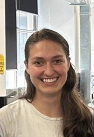

# About Me

Hi, I'm Gabby! 

#### What I'm up to:
I'm a student at UQ, currently in my 6th and final year of a dual Electrical and Computer Engineering & Biomedical Science degree.
In Semester 1 of 2024 I decided to take Professor Brian Lovell's [ELEC4630](https://course-profiles.uq.edu.au/student_section_loader/section_1/131773) course on image processing and computer vision, which is what brought me here!

#### What this is about:
Though I've dabbled a little bit in AI before, this course is the first time I've been properly immersed in deep learning and fastai, in particular. This blog is simply documenting:
+ some of my experiences throughout this journey 🤩
+ any particularly prickly issues encountered 😠
+ interesting things that were worth writing about 🤯

Feel free to follow long and hopefully some of the content may even be relevant and useful to you!
